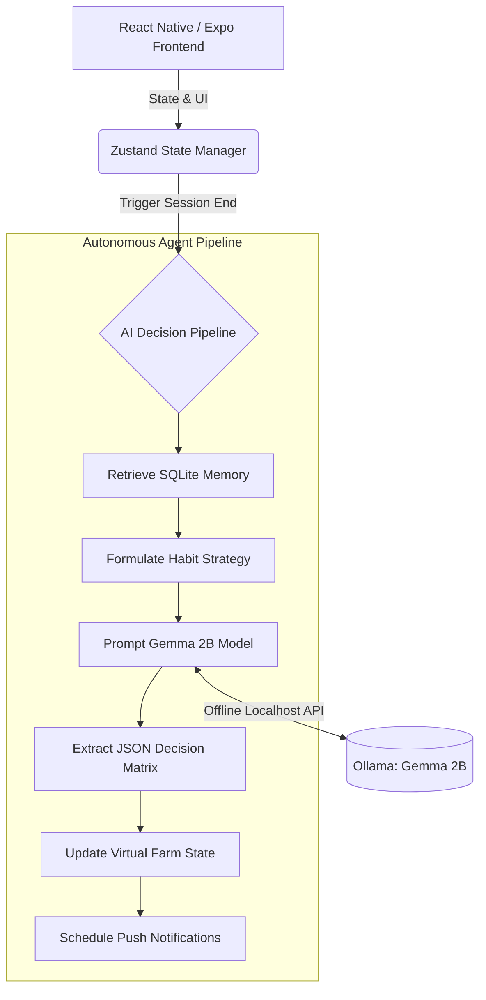

<div align="center">
  
  # BloomMind AI
  
  **Transform your digital habits into a thriving virtual garden. A 100% Offline, Privacy-First AI Coach powered by On-Device Google Gemma.**
  
  [](https://reactnative.dev/)
  [](https://expo.dev/)
  [](https://ai.google.dev/gemma)
  [](https://ollama.com/)
  <br />
  [](https://cursor.com/)
  [](https://vultr.com/)
  [](https://crusoe.ai/)
  [](https://deepmind.google/)
  
  <br />
</div>

## The Global Problem
In today's hyper-connected world, mindless scrolling and social media addiction have become a modern epidemic. Millions of people lose hours daily to non-productive content, leading to decreased attention spans, severe productivity loss, and chronic distraction. Traditional screen-time apps rely on strict blocking or guilt-tripping, which often leads to user frustration and eventual abandonment.

## Our Motivation
We believe that **positive reinforcement** is significantly more effective than restriction. What if the time you save by putting down your phone could literally breathe life into something beautiful? **BloomMind AI** was born to bridge the gap between digital well-being and gamified persistence.

## The Solution: BloomMind AI
BloomMind is a privacy-first, offline-capable mobile application that uses **Google Gemma (On-Device via Ollama)** to act as your personalized digital wellness coach. 

Instead of locking your phone, BloomMind rewards your focus. When you stay away from addictive apps and complete focus sessions, the AI analyzes your behavioral patterns and rewards you with unique seeds. You can plant, grow, and water an interactive virtual garden that reflects your real-life digital health.

## 🏆 Hackathon Track Alignment (Edge / On-Device)
We built this project specifically for **"The Edge / On-Device Track: Best mobile, web, or edge application running Gemma locally for offline, privacy-first inference."**

- **Privacy-First Inference (Top Priority)**: Your personal behavioral data, focus metrics, and failure states never leave your device. All states are logged to local SQLite databases and analyzed securely by local Gemma.
- **100% Offline Engine**: Zero cloud APIs are used for inference. The entire AI Decision Pipeline operates disconnected from the internet.
- **Running Gemma Locally**: Powered exclusively by Google's **Gemma 2B** model operating on the edge hardware.
- **Mobile Application**: Built completely as a cross-platform mobile application using React Native.

### Core Features
| Feature | Description |
| :--- | :--- |
| **Local AI Brain** | Powered by **Gemma 2B** running entirely locally via Ollama. 100% offline reasoning, preserving your privacy while delivering intelligent, dynamic coaching. |
| **Focus-to-Earn** | Stay focused during Pomodoro-style sessions. The AI evaluates your session length and risk levels, rewarding you with XP, water points, and rare seeds. |
| **Interactive Garden** | A stunning, realistic virtual garden. Plant your earned seeds, watch them sprout, grow into mature plants, and unlock environment upgrades like Rain and Lakes. |
| **Intelligent Memory** | The app securely logs your habits using local SQLite, predicting distraction risk and streak-loss probabilities to adjust difficulty dynamically. |
| **Social Synergy (Vision)** | Visit your friends' gardens, compete in focus leaderboards, and use your extra water points to water your friends' dying plants to build a supportive community! |

## Architecture & Technical Stack

Our system is engineered to satisfy the **Google Gemma Hackathon (On-Device / Edge Track)** requirements.



### Project Tree Structure

```text
📦 bloommind
 ┣ 📂 src
 ┃ ┣ 📂 ai                 # The core AI Agent Pipeline
 ┃ ┃ ┣ 📂 pipeline         # Dependency Injected Skills (Memory, Rewards, Farm Update)
 ┃ ┃ ┣ 📜 memory.ts        # Behavioral tracking schema
 ┃ ┃ ┣ 📜 prediction.ts    # Distraction risk & streak heuristics
 ┃ ┃ ┗ 📜 providers.ts     # LocalGemmaProvider (Ollama Integration)
 ┃ ┣ 📂 app                # Expo Router App Navigation
 ┃ ┃ ┣ 📂 (tabs)           # Main Bottom Tabs (Farm, Coach, Statistics)
 ┃ ┃ ┗ 📜 _layout.tsx      
 ┃ ┣ 📂 components         # Reusable UI components (Crops, Grid, UI)
 ┃ ┗ 📂 store              # Zustand Global State (useStore.ts)
 ┣ 📜 proxy.js             # Local Node.js proxy to expose Ollama to Expo LAN
 ┗ 📜 package.json
```

## How to Run Locally (For Judges)

> [!NOTE]  
> **Technical limitation during the Hackathon:**  
> Our primary goal for the Edge/On-Device track was to run the Gemma 2B model natively inside the mobile application (e.g., via MediaPipe or TFLite). However, due to developing entirely on a **Windows machine** without access to a Mac, compiling and testing native C++ AI runtimes for mobile (especially iOS) within the hackathon timeframe was not feasible. 
> 
> As a functional workaround to demonstrate the **Offline/Edge** capabilities, we are running Gemma 2B locally on the host machine via **Ollama**, and the mobile app communicates with it directly over the local network proxy. **No cloud APIs are used.**

Because BloomMind relies on **On-Device inference**, you need to run the Gemma model locally.

### 1. Setup the AI Engine (Ollama)
1. Install [Ollama](https://ollama.com/) on your machine.
2. Open a terminal and run the Gemma 2B model:
   ```bash
   ollama run gemma:2b
   ```
3. Keep the terminal running.

### 2. Run the App
1. Clone the repository and install dependencies:
   ```bash
   npm install
   ```
2. Start the local proxy to allow your phone to communicate with Ollama:
   ```bash
   node proxy.js
   ```
3. Start the Expo development server:
   ```bash
   npx expo start
   ```
4. Scan the QR code using the **Expo Go** app on your iOS or Android device.

---
<div align="center">
  <i>Built for the RAISE Summit Hackathon 2026</i>
</div>
